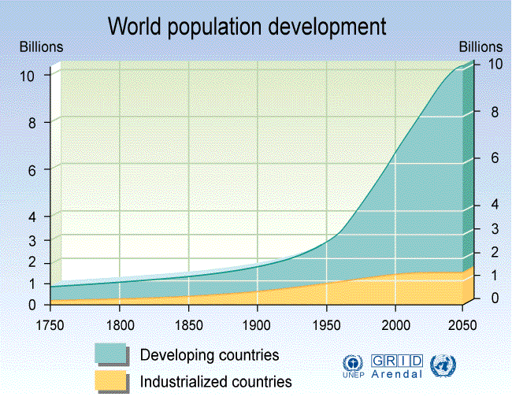
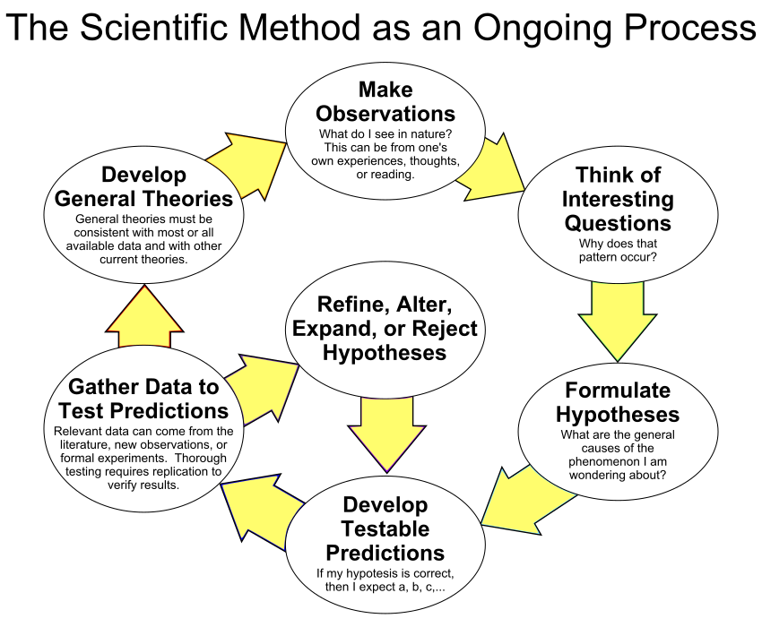

# Environment (18 Jan '18)

## วิทยาศาสตร์และเทคโนโลยี

### การเปลี่ยนแปลงของโลกและประชากร

* หนึ่งใน trendlines ที่พบได้คือประชากรโลกกำลังเพิ่มขึ้น แต่ \\(\frac{d}{dt} ประชากรโลก\\) กำลังลดลง และสังคมกำลังจะกลายเป็นสังคมผู้สูงอายุ  (Image courtesy: [GRID Arendal](http://old.grida.no/graphicslib/detail/world-population-development_29db), 2005)

* ภูเขาน้ำแข็งขนาด 1 ล้านล้านตันลอยออกจากธารน้ำแข็งลาร์เซนซีในขั้วโลกใต้ (ถ้าเราขายได้ตันละสองบาทห้าสิบ เราจะมีเงินพอทำรถไฟความเร็วสูง #ผิด)
* การเติบโตของมนุษย์หนึ่งคนใช้ทรัพยากรจำนวนมาก ปฏิเสธไม่ได้ว่าจำนวนประชากรส่งผลต่อการเปลี่ยนแปลงของสิ่งแวดล้อม

### การประยุกต์วิทยาศาสตร์และความก้าวหน้าทางเทคโนโลยี

* __วิทยาศาสตร์__ คือการศึกษาเกี่ยวกับธรรมชาติทั้งที่มีและไม่มีชีวิต เช่นความสัมพันธ์ระหว่างส่วนต่างๆ ในธรรมชาติทั้งในสภาพนิ่งหรือสภาพที่มีการเปลี่ยนแปลง (fact-finding)
    * การศึกษาวิทยาศาสตร์ต้องศึกษาอย่างเป็นระบบ (systematic) กล่าวคือ__ตั้งปัญหา ตั้งสมมติฐาน พิสูจน์สมมติฐาน นำข้อเท็จจริงมาตั้งเป็นทฤษฎี__  
    *บันทึกจากผู้จด: ในความรู้สึกของผู้จด หนึ่งในสิ่งที่สำคัญของกระบวนการทางวิทยาศาสตร์คือต้องสามารถ__ทำซ้ำได้__ด้วย*

(*[The Scientific Method as an Ongoing Process](https://commons.wikimedia.org/wiki/File:The_Scientific_Method_as_an_Ongoing_Process.svg)*, created by ArchonMagnus, CC4.0)

* __เทคโนโลยี__ คือกระบวนการ/วิธีการและเครื่องมือที่ได้จากการทำเอาความรู้ทางวิทยาศาสตร์และศาสตร์อื่นๆ มาประยุกต์ใช้งาน
    * การใช้เทคโนโลยี ต้องรู้ว่าเทคโนโลยีทำมาอย่างไร ใช้อะไรอย่างไรให้เกิดควาวมเหมาะสม
        * เทคโนโลยีเป็นพื้นฐานในการจัดการสิ่งแวดล้อม *(รอแปะแผนภาพจำลองการผลิตในอุตสาหกรรม)*
        * เช่นการจัดการของเสีย (cleaning technology: CT)
            * waste management เริ่มจากการบำบัดและการทิ้ง พัฒนากลายเป็นการใช้ซ้ำและการรีไซเคิล และควรพัฒนาไปเป็นการลดการใช้ทรัพยากรที่แหล่งกำเนิด
            * การลดแล่งกำเนิดนั้นยั่งยืนที่สุด เพราะสะอาด และไม่ส่งผลกระบ รวมถึงราคา (cost) ที่ต้องจ่ายในการบำบัด
