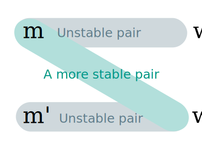

# Algorithm Design (10 Jan '18)
*คำเตือน: เลกเชอร์โน้ตนี้เป็นการ "สรุป" สิ่งที่อาจารย์สอนในห้อง โจทย์ ตัวอย่าง และปัญหาบางส่วนอาจจะไม่เป็นไปตามที่สอน*

## Stable Marriage Problem
มีผู้ชาย $n$ คน และผู้หญิง $n$ คน ต้องการจับคู่ที่__เสถียร__ กล่าวคือเป็นไปตามตารางความชอบของแต่ละคน จะหาเซตของการจับคู่ $\mu = \\{(m,w) | m \in M, w \in W\\}$ ที่ต่างก็ได้คู่ที่ชอบได้อย่างไร?

### Example
มีผู้ชายสามคน ได้แก่ A, B, C, D ตามลำดับ และมีผู้หญิงสามคน ได้แก่ a, b, c, d ตามลำดับ โดยให้เงื่อนไขการชอบกันเป็นไปดังนี้

* __สำหรับผู้ชาย__
    * A ชอบ a>b>c>d (ชอบ a ที่สุด รองลงมาคือ b...)
    * B ชอบ b>d>c>a
    * C ชอบ c>b>a>d
    * D ชอบ a>d>c>b
* __สำหรับผู้หญิง__
    * a ชอบ C>A>B>D
    * b ชอบ C>B>D>A
    * c ชอบ B>C>A>D
    * d ชอบ A>D>C>B

เราสามารถนิยามคำว่า__การจับคู่ที่ไม่เสถียร__ และ__คู่ไม่เสถียร__ ได้ดังนี้:

<div class="alert alert-primary" role="alert">
<b>นิยาม: การจับคู่ที่ไม่เสถียร</b> คือเซ็ตของการจับคู่ที่มีคู่ที่ไม่เสถียร 
</div>

<div class="alert alert-primary" role="alert">
<b>นิยาม: คู่ที่ไม่เสถียร</b> คือคู่อันดับ $(m,w)$ ที่ $m$ ชอบ $w'$ ใดๆ มากกว่า $w$ <b>และ</b> $w$ ชอบ $m'$ ใดๆ มากกว่า $m$ 
</div>

กล่าวคือ ถ้ามีคู่ $(m,w)$ และ $(m',w')$ ที่ $m$ ชอบ $w'$ มากกว่า $w$ __และ__ $w'$ ชอบ $m$ มากกว่า $m'$ เพราะเราจะพบว่าคู่ $(m,w')$ เป็นคู่ที่ดีกว่า (เพราะชอบกันทั้งสองฝ่าย)



เราสามารถใช้อัลกอริทึมชื่อ __Gale-Shapley's Algorithm__ ในการแก้ปัญหานี้

### Gale-Shapley's Algorithm

ต่อไปนี้จะเขียนบ่อด้วย "GS Algorithm", ตัววิธีการสามารถเขียนเป็น pseudocode ได้ดังนี้

```python
ระหว่างที่ ยังมีผู้ชายโสดเหลือ:   
    ให้ m := ผู้ชายโสดคนที่พิจารณา   
    ให้ w := ผู้หญิงที่ดีที่สุดของ m
    m.จีบ(w)
    ถ้า w.โสด:
        w.คบกับ(m)
    มิฉะนั้น:
        ให้ x := คู่ของ(w)
        ถ้า x ดีกว่า m ในสายตา w:
            เลือก x
        มิฉะนั้น:
            w.บอกเลิก(x)
            w.คบกับ(m)
```

เรารับรองได้ว่าอัลกอริทึมนี้จะจบการทำงานในเวลา \\(\mathcal{O}(n^2)\\)

จะใช้วิธีการ Proof by contradiction โดยสมติมีคู่ที่ไม่เสถียร เพื่อพิสูจน์ว่าการทำงานของอัลกอริทึมนี้ให้ผลลัพธ์ที่เสถียรได้ (ละวิธีการพิสูจน์)

ทั้งนี้ทั้งนั้น__อัลกอริทึมนี้จะให้คำตอบที่ดีที่สุดกับผู้ชาย และคำตอบที่แย่ที่สุดกับผู้หญิง__ ([#feminism](https://twitter.com/search?q=%23feminism) [#algorithm](https://twitter.com/search?q=%23algorithm))  

*เนื้อหาส่วนบทพิสูจน์ข้างล่างไม่สมบูรณ์ และขี้เกียจจะเขียนแล้ว*

สามารถพิสูจน์ได้ว่าอัลกอริทึมนี้ให้ผลที่ดีที่สุดกับผู้ชาย ด้วยการสมมติว่ามีผู้ชายบางคนได้คู่ที่ไม่ดีที่สุด นั่นหมายถึงสำหรับผู้ชาย \\(m\\) ที่มีเนื้อคู่ \\((m,w)\\) ที่ $w$ ไม่ได้เลือก $m$ เป็นอันดับหนึ่ง จะโดนเนื้อคู่ $w$ ทิ้ง  
เราสามารถใช้ __Well-ordering principle (กฏการเรียงลำดับอย่างดีแล้ว)__ ในการเรียงลำดับใดๆ ของเซตจำกัดจากข้อมูลได้เสมอ (เช่น ใคร {สูง, อ้วน, ใส่รองเท้าใหญ่, ...} ที่สุดใน {ห้อง, รุ่น, CPE, กรุงเทพฯ, ประเทศ, ...})

เมื่อให้คำตอบจาก GS Algorithm เป็น $\mu$ และให้คู่ \\((x,w) \in \mu\\) (กล่าวคือ \\(w\\) ชอบ \\(x\\) มากกว่า \\(m\\))
เนื่องจาก (m,w) เป็นเนื้อคู่กัน ดังนั้นต้องมีการจับแบบหนึ่งที่เป็นไปได้ $O$ ที่ \\((m,w) \in O\\) (โดยที่ $O$ ไม่ใช่คำตอบ $\mu$)
