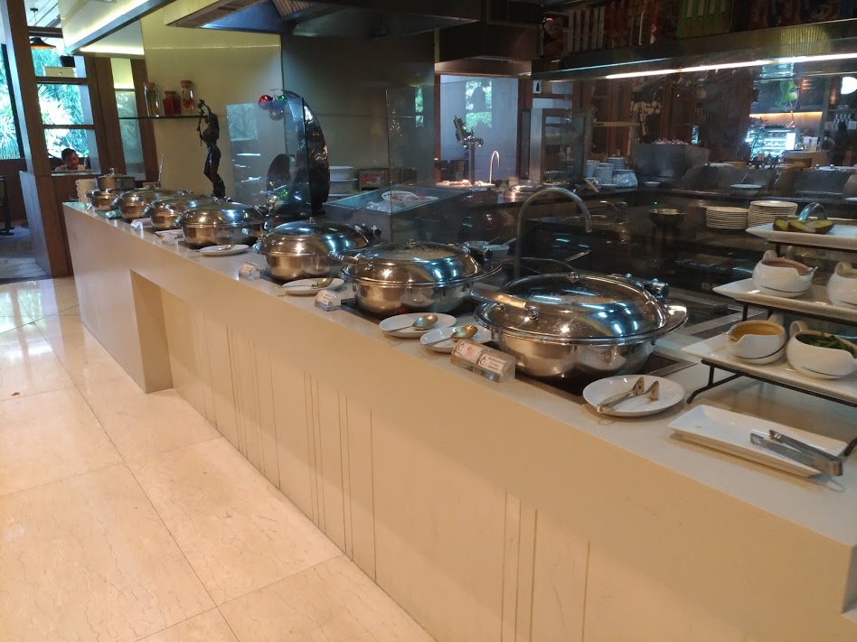
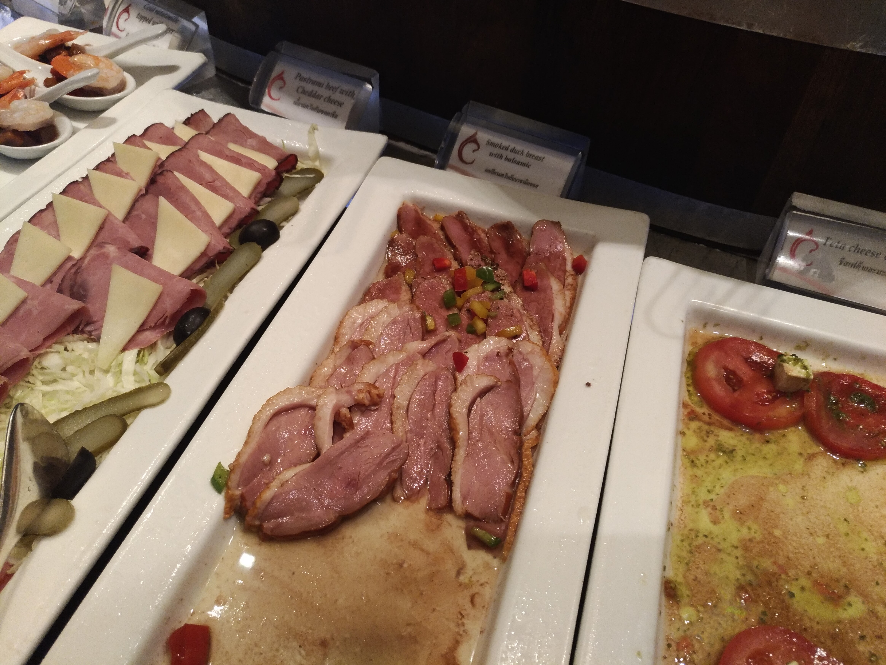
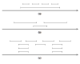

# Algorithm Design 4 - Greedy Algorithm (1)

*คำเตือน: เลกเชอร์โน้ตนี้ไม่ได้เขียนในห้อง (ดังนั้นความจริงไม่ควรจะเรียกว่าเป็นเลกเชอร์โน้ตด้วยซ้ำ) แต่กระนั้นก็พยายามเขียนเท่าที่อาจารย์สอนให้ได้มากที่สุด*

## Greedy Algorithm คืออะไร

คำแปลของวลี "Greedy Algorithm" ในภาษาไทยคือ "อัลกอริทึมแบบตระกลาม" (แม่เจ้าโว้ย เอากับเขาสิ)



ด้วยความที่คุณเป็นคนรวย คุณจึงเดินเข้าไปในร้านบุฟเฟ่ต์เจ้าหนึ่ง แม้จะรู้ว่ายังไงร้านก็กำไร ถึงกระนั้นแทบทุกคนที่เข้าไปกินบุฟเฟ่ต์ก็ต่างมีเป้าหมายตรงกันว่า **"กูจะแดกให้คุ้มที่สุด"**



คำถามคือจะกินยังไงดีล่ะถึงจะคุ้มที่สุด? คุณพบว่าอาหารแต่ละอาหารมีจำนวนจำกัด อาหารแต่ละอย่างตีเป็นมูลค่าได้ต่างกัน (เช่นเนื้อแกะแพงกว่าข้าวสวย) และด้วยความที่เป็นอาหาร คุณสามารถตักแบ่งได้ด้วย

วิธีการของคุณในการกินอาหารให้คุ้มที่สุดภายใต้ปริมาณกระเพราะที่จำกัด อาจจะเป็นไปได้ดังนี้

* __กินอาหารที่แพงที่สุด ไม่กินอย่างอื่น__ ถือว่าโอเค เพราะได้กินของแพง แต่คงไม่คุ้มเท่าไหร่ถ้าอาหารนั้นมีน้อย เพราะคุณจะกินไม่อิ่ม (ไลน์บุฟเฟ่ต์หลายที่มาเติมช้าจะตาย -- ยกเว้นที่ในรูป ของเค้าดีจริง :P)
* __กินอาหารที่กินได้เยอะหน่วยที่สุด__ เช่น คุณกินได้หนึ่งกิโล มีข้าวสวยหนึ่งกิโล และแซลม่อนหนึ่งกิโลครึ่ง คุณไม่สามารถกินแซลม่อนหนึ่งกิโลครึ่งได้ (เพราะเกินความจุ) จึงเลือกกินข้าวสวย -- วิธีนี้ไม่น่าจะคุ้ม (ยกเว้นคุณเป็นสายกินแป้ง ซึ่งถ้าเป็นแบบนั้นสังข้าวเปล่ากินเห๊อะ...)
* __กินของที่ราคาต่อน้ำหนักแพงสุดจนหมดแล้วค่อยกินของถูกลงมาเรื่อยๆ__ วิธีนี้ดี! เพราะว่าคุณจะพยายาม maximise มูลค่าอาหารที่คุณกินเข้าไปได้ ที่สำคัญคือกินจนอิ่มด้วย

และสามารถเขียนเป็น pseudocode ของการกินได้ดังนี้

```
ระหว่างที่ ยังไม่อิ่ม:
    หาของชิ้นที่มูลค่าต่อน้ำหนักแพงที่สุด
    กินของชิ้นนั้น ไม่จนกว่าจะอิ่มก็จนกว่าจะหมด
```

ดังนั้นเราเลยเรียกอัลกอริทึมนี้ว่า "Greedy" เพราะจะพยายามแดกทุกอย่างให้คุ้มที่สุด

## แนวคิดของ Greedy Algorithm

จริงๆ แล้วเราสามารถนิยาม Greedy Algorithm ได้ว่า

<div class="alert alert-primary"> 
<b>อัลกอริทึมตระกลาม</b> <i>(เกลียดคำนี้โว้ยยยย)</i> คืออัลกอริทึมที่ผลเฉลยของปัญหาได้จากการตัดสินใจที่เหมาะสมที่สุด ณ สภาพเวลานั้น แล้วค่อยๆ ลดขนาดของปัญหาลงไปเพื่อตัดสินใจต่อ
</div>

เราจะมีหลักการทั้งหมดสองข้อในการพิสูจน์ว่า Greedy Algorithm ของเราให้ผลของคำตอบที่ดีที่สุด หลักการสองข้อนั้นคือ

* Greedy stays ahead
* Exchange arguments

ในไฟล์นี้จะกล่าวแต่ถึง Greedy Stays Ahead ซึ่งเหมือนจะง่ายกว่าต่อการพิสูจน์

### Greedy Stays Ahead

คือการบอกว่า

<div class="alert alert-success">
<p>สำหรับอัลกอริทึม Greedy ใดๆ ซึ่งมีขั้นตอนที่ $i$ เป็น $G_i$ และผลเฉลยของปัญหาที่ดีที่สุดของอัลกอริทึมนี้ ที่คำตอบของขั้นตอนที่ $i$ คือ $O_i$ การตัดสินใจในขั้นตอนที่ $i$ ทุกขั้นตอนของ Greedy Algorithm ให้ผลที่ดีกว่าหรือดีเท่ากับของผลเฉลย</p>

กล่าวคือ $$S_i \leq O_i \quad \forall i$$
</div>

และในการพิสูจน์ว่า Greedy Stays Ahead เราจะพยายามทำตามขั้นตอนดังนี้

* __หา Algorithm__ แน่นอน ถ้าไม่หาก็ prove ไม่ได้นะจ๊ะ
* __หาทางวัดประสิทธิภาพเทียบ optimal solution__ กล่าวคือ เมื่อให้ Greedy มีผลเฉลย $S$ จากอัลกอ และให้ผลเฉลยที่ดีที่สุดของโจทย์เป็น $O$ จะพบว่าผลเฉลย $s_i$ (ผลเฉลยของ $S$ ในขั้นตอนที่ $i$) ให้ผลดีกว่าหรือเทียบเท่า $o_i$ (z(ผลเฉลยของ $O$ ในขั้นตอนที่ $i$) เสมอ (เรามักใช้วิธี induction)
* __บอกว่าผลเฉลยจาก Greedy ให้ประสิทธิภาพที่ดี__ กล่าวคือ ไม่มีผลเฉลย $O$ ที่ดีกว่าผลเฉลย $S$ (เรามักใช้วิธี prove by contradiction)

เพื่อยกตัวอย่างให้เห็นภาพ จะพิสูจน์ Greedy Stays Ahead กับปัญหาการเลือกกินอาหารบุฟเฟ่ต์ให้ดู

<div class="alert alert-warning">
ตัวอย่าง: พิสูจน์ว่าการเลือกกินของที่ปริมาณต่อหน่วยมากที่สุดไปเรื่อยๆ จะเป็นวิธีที่คุ้มที่สุด
</div>

ในกรณีนี้เราต้องพิสูจน์อยู่สองกรณี

__1) พิสูจน์ว่าการเลือกกินของที่แพงที่สุดต่อหน่วยน้ำหนักเป็นการแก้ปัญหาย่อยที่ดีที่สุด__

จะพิสูจน์โดยตรง ว่าหากมีของที่มีมูลค่าต่อน้ำหนักดีที่สุด อัลกอริทึมจะเลือกหยิบของชิ้นนั้นทันที ดังนั้นอัลกอริทึมนี้ประสบความสำเร็จในการค่อยๆ เลือกของที่แพงที่สุด (กล่าวคือเลือกของที่แพงที่สุดก่อน แล้วค่อยๆ หยิบของที่แพงรองลงมาเรื่อยๆ) วิธีนี้จะให้ความคุ้มค่ามากที่สุด

__2) การแก้ปัญหาย่อยแบบนี้จะทำให้ได้ผลเฉลยรวมที่ดีที่สุดด้วย__

สามารถแสดงให้เห็นได้ง่ายๆ ว่าอัลกอริทึมนี้พยายามที่จะ maximise มูลค่าต่อน้ำหนักของอาหาร ซึ่งจะทำให้สามารถทานอาหารได้คุ้มที่สุด เพราะมูลค่าอาหารที่ทานไปเท่ากับ $มูลค่าต่อน้ำหนักเฉลี่ย \times ความจุกระเพาะ$ จึงได้ว่าทานของแพงสุดก่อนก็จะคุ้มที่สุดแล้ว

## ตัวอย่างปัญหาการเรียงตารางเวลา

เพราะคุณเป็นมือฉมังในวงการเขียนโค้ด (หลับตาเขียนด้วยตีนเดียวยังได้) คุณมีนัดประชุมกับทีมของบริษัท $N$ ทีม แต่คุณรู้ดีว่าเวลาในชีวิตคุณมีจำกัด และคุณไม่สามารถประชุมกับทุกทีมได้

การประชุมทุกการประชุม (กล่าวคือการประชุมที่ $i$) มีเวลาเริ่มประชุมเป็น $s_i$ และเวลาเลิกประชุมเป็น $f_i$ กรุณาหาว่าคุณจะประชุมอย่างไรให้__ได้จำนวนการประชุมเยอะที่สุด__

(พักสองนาที ให้ลองคิดวิธีแก้ปัญหาที่ต่างๆ กันไปก่อน... เดี๋ยวเราจะมาต่อกัน)

คุณอาจจะคิดวิธีการแก้ปัญหาได้หลายแบบดังนี้

* __เลือกเข้าประชุมที่เริ่มประชุมเร็วที่สุด__ ก็เหมือนจะดี แต่ถ้ามันประชุมเร็ว เลิกดึกล่ะ... เราอาจจะมีการประชุมอื่นที่กินเวลาน้อยกว่านี้ติดๆ กันก็ได้ (รูป a)
* __งั้นเลือกการประชุมที่ใช้เวลาน้อยที่สุดก่อน__ ถ้ามีประชุมเร็วๆ อันเดียวแล้วมันไปทับกับประชุมยาวๆ สองอันล่ะ... ก็ไม่ดีอีก (รูป b)
* __นับว่าแต่ละการประชุมมีการประชุมที่ทับกับชาวบ้านกี่อัน แล้วเลือกอันที่ทับน้อยที่สุดเรื่อยๆ จนเต็ม__ เจ๋ง แต่ยากไป แถมกรณี (รูป c) อัลกอฯ นี้จะบอกว่าการประชุมสี่อันบนสุดทับกับชาวบ้านเยอะมาก และจะไม่เลือกสี่อันบน ทั้งที่ความจริงการเลือกประชุมสี่อันบนคือวิธีการที่ดีที่สุด



*(ปาดเหงื่อ)* แล้วเรามีวิธีการดีไซน์ Greedy algorithm ที่ดีจริงๆ เหรอ? คำตอบคือมี! เหตุผลคือถ้ามันไม่มี มันคงไม่อยู่ในเนื้อหาบทนี้อ่ะครับ *(วะวะวะ หว่ายยยย)*

เราพบว่าเราสามารถเลือกประชุมที่__เลิกเร็วที่สุด__ ก่อนได้ แล้วค่อยๆ ไล่การประชุมที่เลิกเร็วที่สุดต่อๆ มาเรื่อยๆ หรือเขียนเป็น pseudocode ได้ดังนี้

```python
นิยามฟังก์ชั่น เลือกประชุม(รายการการประชุม):
    ให้ รายการการประชุมที่จะเข้า = [] # เซ็ตว่าง
    ให้ รายการการประชุมที่เข้าไม่ได้ = [] #เซ็ตว่าง
    เรียง รายการการประชุม โดยเอาการประชุมที่เลิกเร็วสุดไว้ตัวแรก
    ระหว่างที่ รายการการประชุม ยังไม่ว่าง:
        # เลือกเข้าประชุมกับการประชุมที่เลิกเร็วที่สุด
        ย้าย การประชุมอันดับแรก ไปไว้ รายการการประชุมที่จะเข้า
        # ถ้าอันไหนทับกันก็แปลว่าเข้าไม่ได้
        สำหรับทุก การประชุม ใน รายการการประชุม:
            ถ้า การประชุม ทับกับ การประชุมที่จะเข้า:
                ย้าย การประชุม ไปไว้ รายการการประชุมที่เข้าไม่ได้
    ส่งคืนค่า รายการการประชุมที่จะเข้า
``` 

(ต่อไปนี้จะเป็นบทพิสูจน์ อาจจะยาวและเหนื่อย ถ้าจะลุยต่อยาวๆ แนะนำให้[ฟังเพลงก่อนสักนิดนึง](https://www.youtube.com/watch?v=zdgemowocu8))

ในกรณีนี้เราสามารถพิสูจน์ได้ว่าอัลกอริทึมนี้เจ๋งจริงๆ ได้ดังนี้

ขั้นแรกของการพิสูจน์ Greedy Algorithm ด้วยแนวคิดของการ stays ahead คือการมองว่าตัวอัลกอฯ จะให้คำตอบ $S$ ซึ่งเมื่อเทียบกับผลเฉลย $O$ แล้ว $|S| \geq |O|$ (จำนวนการประชุมที่เข้าได้ มากกว่าหรือเท่ากับของผลเฉลยใดๆ เพราะเราอยากเข้าประชุมให้ได้มากที่สุดนี่นา)

เราจะทำการพิสูจน์แง่มุมต่างๆ ของอัลกอดังนี้

__1) สำหรับกา่รเลือกงานใดๆ เวลาเลิกประชุมของทุกการประชุมที่ Greedy Algorithm คำนวนได้ จะเลิกเร็วกว่าหรือเท่ากับผลเฉลย__

__วิธีทำ:__ ให้เซ็ต $S$ เป็นเซ็ตของการประชุมที่อัลกอฯ บอกว่าจะเข้าร่วม และให้เซ็ต $O$ เป็นเซตของรายการการประชุมใดๆ

เราจะเขียนแทนเซ็ต $S$ ด้วย $S = \\{i_1, i_2, i_3,... ,i_n\\}$ และ เซ็ต $O$ ด้วย $O = \\{j_1, j_2, j_3,..., j_n\\}$ และเวลาการเลิกประชุมของการประชุมที่ $k$ ด้วย $f(k)$

เราจะใช้ mathematical induction เพื่อแสดงว่า $$f(i_x) \leq f(j_x) \quad \forall x \leq จำนวนการประชุมที่จะเข้า$$

และจะสามารถ prove ได้ดังนี้

* __Basic step__

  สามารถกล่าวได้ว่า $f(i_1) \leq f(j_1)$ ได้ทันที เพราะเราเขียนอัลกอให้หยิบตัวที่เลือกเวลาเลิกเร็วที่สุดก่อนอยู่แล้ว

* __Induction step__

  จะบอกว่า $f(i_x) \leq f(j_x)$ สำหรับ $x = 1...n-1$ แล้วจะพิสูจน์ว่า $f(i_n) \leq f(j_n)$ เป็นจริงเพื่อเป็นการพิสูจน์ขั้นสุดท้าย

* __Proving__

  สามารถกล่าวได้ว่า $f(i_n) \leq f(j_n)$ ได้ทันทีเหมือนกัน เพราะเราเขียนอัลกอให้หยิบตัวที่เลือกเวลาเลิกเร็วที่สุดก่อนอยู่แล้ว

ดังนั้นจึงเป็นการพิสูจน์ว่าอัลกอฯ นี้จะหยิบการประชุมที่เลิกประชุมเร็วที่สุดที่เป็นไปได้เสมอ

และเราจะเหลือการ prove อีกอันสั้นๆ ว่า

__2) อัลกอริทึมนี้จะให้คำตอบที่ดีที่สุดเสมอ__

*(โปรดอย่างง: ตะกี้เราพิสูจน์ว่าสำหรับการเลือกประชุมนั้นเราได้__เวลาเลิกประชุม__ที่ดีที่สุด แต่ตอนเราจะพิสูจน์ว่า__ผลเฉลย หรือการเลือกเข้าประชุม__นั้นดีที่สุด)*

__วิธีทำ:__ ถ้าเซ็ตของการเข้าประชุม $S$ ที่เราคิดได้__ไม่ใช่__การเข้าประชุมที่ดีสุดจริง นั่นหมายถึงมีเซ็ตของผลเฉลย $O$ ที่ $n(S) < n(O)$ (มีเซ็ตของคำตอบที่เลือกเข้าประชุมได้มากกว่าที่อัลกอเราสามารถให้คำตอบได้)

ถ้ามีผลเฉลยในเซ็ต $O$ มากกว่าในเซ็ต $S$ โดยวิสัยแล้วอัลกอฯ ของเราควรจะหยิบผลเฉลยนั้น (ซึ่งเป็นผลเฉลยตัวสุดท้าย) มาด้วย เพราะว่าอัลกอของเราจะหยุดเมื่อ

* ไม่สามารถหยิบผลเฉลยได้แล้วเท่านั้น ซึ่งชัดเจนว่าในกรณีนี้ไม่ใช่
* หยิบผลเฉลยไม่ได้ (เพราะเวลาทับซ้อน) ซึ่งกรณีนี้จะไม่เกิดขึ้น เพราะว่าอัลกอฯ ของเราจะหยิบผลเฉลยตัวสุดท้ายที่ดีกว่า $O$ เสมอ (todo: ใส่รูปประกอบ) ดังนั้นจึงไม่มีกรณีที่ $n(M) < n(O)$

กล่าวคืออัลกอริทึมนี้ให้ผลเฉลยที่ดีที่สุด
